# Portfolio
The portfolio only represent only for creating new UX technologies.
Also I've made these technologies on my own.


## 1. PianoEffect


:musical_keyboard: Piano Effect is a new way for editing text naturally on TextView. It allows you to edit text easily and gracefully. As soon as you touch a text, the text jumps up like a wave, the text that move along the cosign graph make us feel playing piano. You can edit it at the same time you swipe it to the right. If you want to erase the attributes what you add, just swipe left. And also you can check the character that you are selecting currently by character's opacity. You can customize attribute like font, color, line, shadow and so on.Even if you can copy/cut operation using piano Effect.

### Why

- uncomfortable for editing text on touch screen.

### How

- Make it comfortable and natural

### What

- Allows you to highlight any text just as you would do on a paper.
- Not limited to highlighting, you can edit any text attributes.

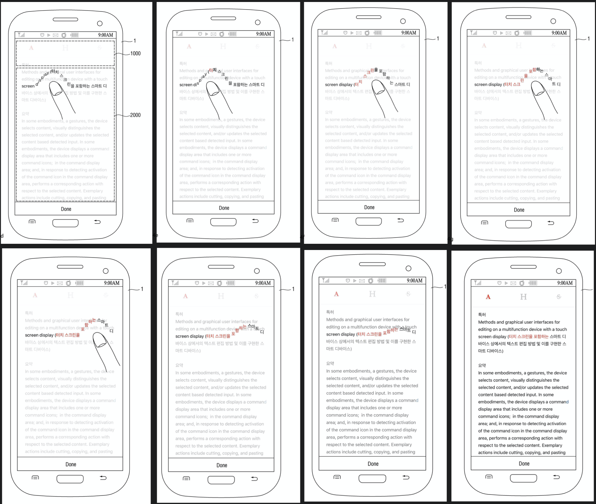

### Getting Started

1. You can download an App for using PianoEffect.</br>
https://itunes.apple.com/app/id1200863515 </br>
https://itunes.apple.com/app/id1436948695

2. The domains of a function, in charge of making the texts to pop, are defined as a distance from the touch point to the end of a text.
	- x = abs(touchX - characterX)
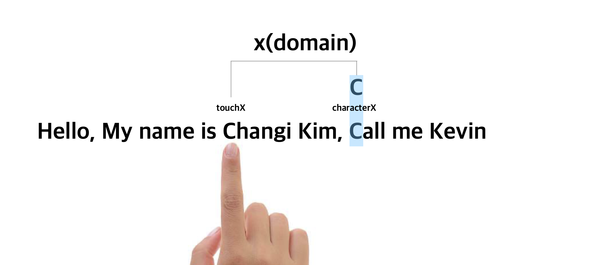

3. In order to make text pop action smooth, the functions for Cosine and constant are defined according to its domains.
	- y = a(cos(PI * x / b) + 1) * p { x < b }
	- y = 0 { x ≥ b }</br></br>

	> b: a half of cosine period </br>
	> a: maxHeight of popping text</br>
	> p: progress of floating text
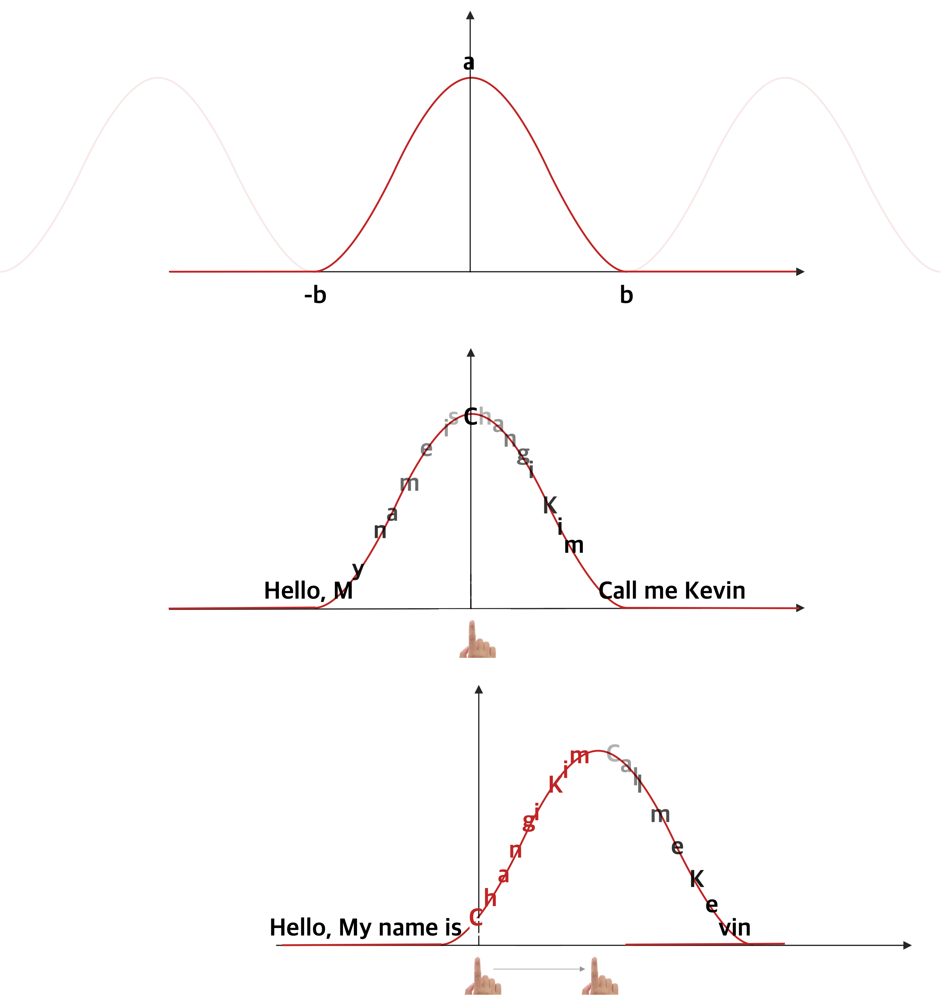
- By applying the above function expression, you can change the height at which the text bounces according to the movement of the touch.

4. There are three core logics to implement this.

- Get text line information which text line includes the touch point.

```swift
private func lineInfo(at touch: Touch) -> (CGRect, NSRange, NSAttributedString)? {
	guard attributedText.length != 0 else { return nil }
	var point = touch.location(in: self)
	point.y -= textContainerInset.top
	let index = layoutManager.glyphIndex(for: point, in: textContainer)
	var lineRange = NSRange()
	let lineRect = layoutManager.lineFragmentRect(forGlyphAt: index, effectiveRange: &lineRange)
	let attrText = attributedText.attributedSubstring(from: lineRange)
	return (lineRect, lineRange, attrText)
}
```
- Depending on the touch, the text is animated according to the above function expression, and the coordinates to edit text are calculated.
```swift
private func move(_ label: PianoLabel, by touchX: CGFloat) {
	guard let data = label.data else { return }
	let distance = abs(touchX - data.charOriginCenter.x)
	let rect = data.charRect
	if distance < cosPeriod_half {
		let y = cosMaxHeight * (cos(CGFloat.pi * distance / cosPeriod_half ) + 1) * progress
		label.frame.origin.y = rect.origin.y - y
		if !(touchX > rect.origin.x && touchX < rect.origin.x + rect.width){
			label.alpha = distance / cosPeriod_half + 0.3
		} else {
			label.alpha = 1
		}
	} else {
		label.frame.origin = rect.origin
		label.alpha = 1
	}
}
```

- When you release your finger, you will get the coordinates to add / delete effect and give it to the text view.
```swift
private func setAttributes(with addRanges: [NSRange], removeRanges: [NSRange) {
	for addRange in unionAddRange {
		textStorage.addAttributes([.backgroundColor: Color.highlight], range: addRange)
		layoutManager.invalidateDisplay(forGlyphRange: addRange)
	}
	for eraseRange in unionEraseRange {
		textStorage.addAttributes([.backgroundColor: Color.clear], range: eraseRange)
		layoutManager.invalidateDisplay(forGlyphRange: eraseRange)
	}
}
```
### License
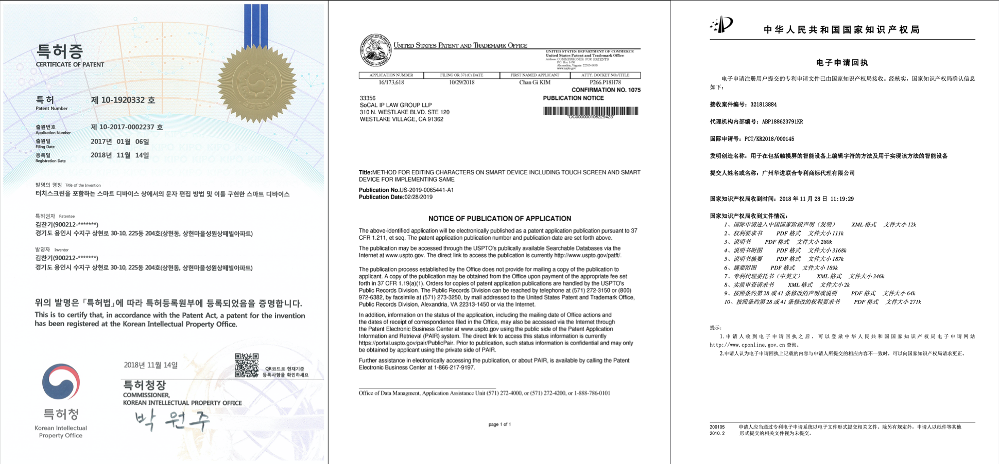
- Jan, 2017 Patent applied in South Korea
- Oct, 2018 Patent registered in South Korea
- Nov, 2018 Patent applied in USA
- Nov, 2018 Patent applied in China

</br></br></br></br>
## 2. magnifying glass

:mag: Type faster, reduce typo. That's what magnifying glass do.
Reflecting and magnifying your paragraph currently typing, and also you can tap this magnifying view for edit typo.
You can typing and fix typo quickly.

### Why
- Distance between cursor and keboard makes typo frequently.
- Uncomfortable when edting text.
- The character size is too small to edit.

### How
- Remove distance.
- Enlarge text size for editing text easily.


### What
- Show currently tying paragraph on keyboard.
- enable to edit character on magnifying view by tapping.

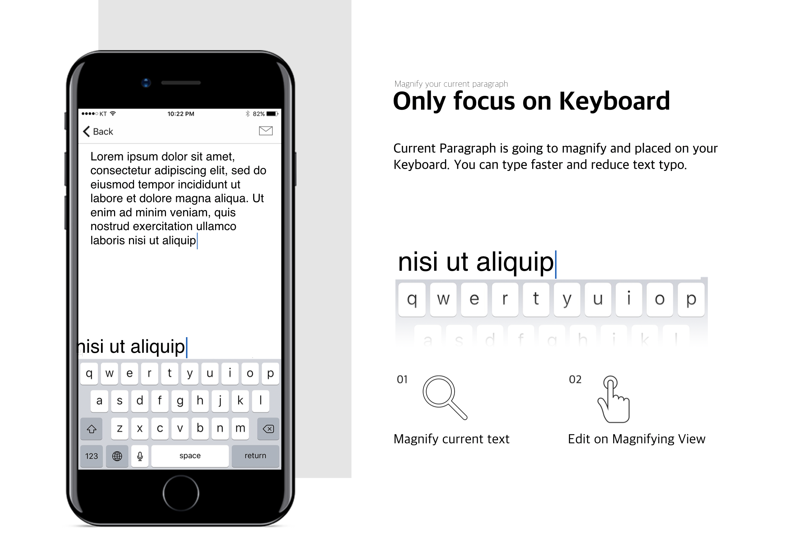

### Getting Started

1. In textView delegate textViewChangeSelection, get current paragrapgh and set to the magnifying view.

```swift
let paragraphRange = (textView.text as NSString).paragraphRange(for: textView.selectedRange)
let attrText = getAttrTextForMagnifyingText(from: textView, inRange: paragraphRange)
setAttrText(attrText)
```

2. Set scroll offset.
```swift
let frontRange = NSMakeRange(0, textView.selectedRange.location - paragraphRange.location)
let frontWidth = attrText.attributedSubstring(from: frontRange).size().width
setScrollOffset(by: frontWidth)
setCursorViewLocation(by: frontWidth)
```

3. Allows to response the tap and sync with textView.
```swift
@IBAction func tap(_ sender: UITapGestureRecognizer) {
	let touch = sender.location(in: self)
	guard let glyphIndex = mfLabel.getGlyphIndex(from: touch),
	let textView = self.textView,
	let attrText = mfLabel.attributedText,
	attrText.length != 0
		else { return }

	let cursorIndex = touch.x < 0 ? glyphIndex : glyphIndex + 1
	let frontAttrText = attrText.attributedSubstring(from: NSMakeRange(0, cursorIndex))
	let frontAttrTextWidth = frontAttrText.size().width
        
	setCursorViewLocation(by: frontAttrTextWidth)
	setTextViewSelectedRange(textView: textView, byFrontText: frontAttrText.string, byCursorIndex: cursorIndex)
    }
```
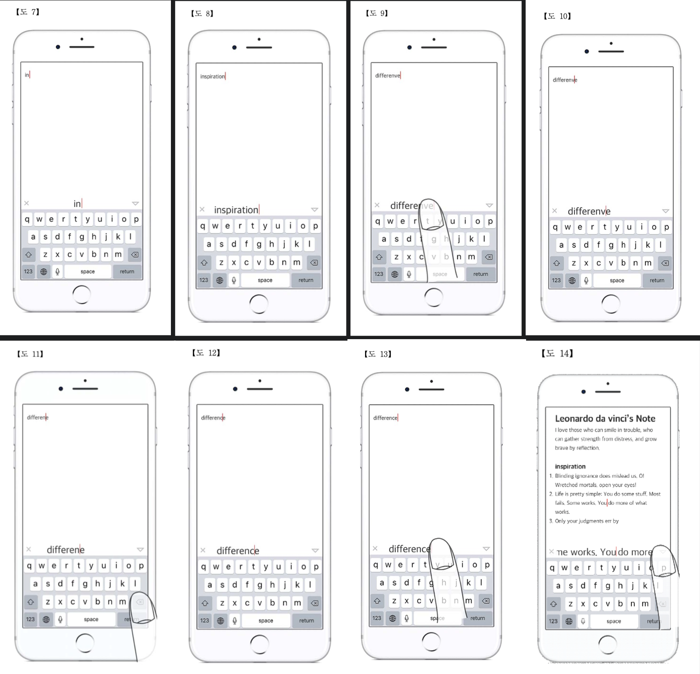
### License
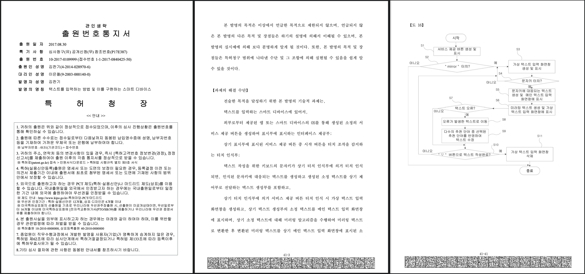
- Oct, 2017 Patent applied in South Korea

</br></br></br></br>
## 3. FastestTextView
<br/><br/>
:zap:FastestTextView is the Fastest TextView rendering  tml/rtfd and also it reduces data size to less than half. 
It owns new data structure itself and it makes textview fast whether document size is so big.
Even if it gives you easy and fast way to edit text by easy gesture.

### Why
- When the documents being loaded, rendered,  typed and edited by user,
- TextView makes a lot of performance issues. It makes transitioning, rendering, typing, editing slowly.
- It makes feel annoying to user and User cannot produce on their document in Mobile environment.

### How
- To reduce Memory Usage, Create a New Data Structure for documents.
- To make it faster, Recreate a New TextView.

### What
- Use String Type for represent all document’s data.
- String type can use a lot of great performance functions

### Result
1. Reduce document data memory
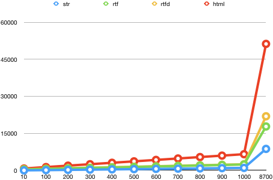<br/>
FastestTextView convert NSAttributedString to Custom String Type.
- It is half the size of rtf (48%)
- It is one third of rtfd's size (36%)
- It is one sixth of html's size (16%)

2. Always be fast
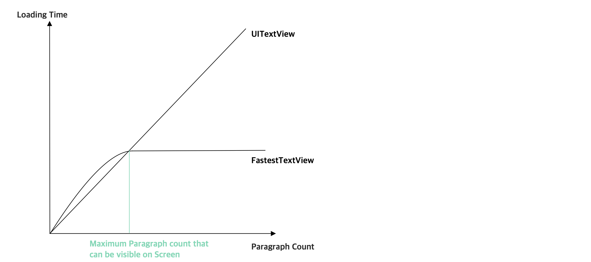<br/>
- whether document is big size, always be fast.

### Getting Started

1. You can download an App for using InteractiveTextView. https://itunes.apple.com/app/id1436948695 
<br/>

2. To convert user’s NSAttributedString to String, Make a block per one paragraph. Block can be a string and it can represent all attributes for text.
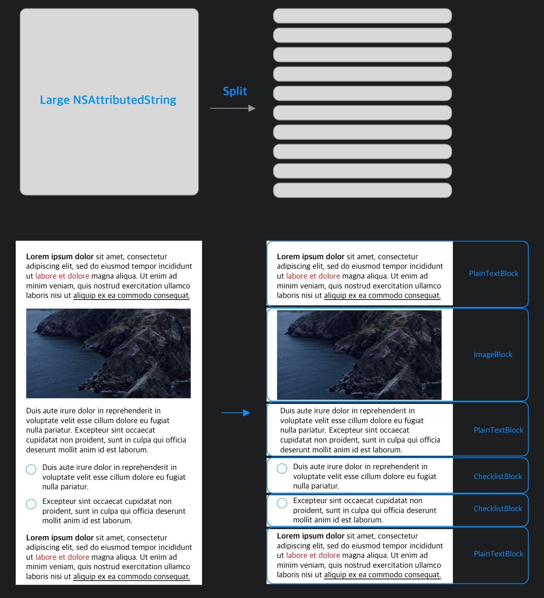<br/>

3. To create a fast and interactive textview, It inherits UITabieView, and each cells get one paragraph. 

4. It is implemented all features of UITextView and more.
Built in
- Floating Cursor when there's no cells in tableView
- Moving cursor between Cells
- ConvertBullet
- Make Header
- revertBullet
- removeBullet
- Undo, Redo
- Leading swipe for making Header
- Trailing swipe for copy/delete
- Edit for Copy/Cut/Delete

5. To support various types like images, video and voice, You can extend Block Type whatever you want.
```swift
enum BlockType {
  case text([String])     //"0"
  case asset([String])    //"1"
  case card([String])     //"2"
  case analysis([String]) //"3"
}
```

### More
- Improve the performance of scrolling, it uses prefetch system.
- It uses a lot of String type and [String] type functions for performance like joined(separator:), components(separatedBy:)

</br></br></br></br>
## 4. EmojiChecklist

:metal: Emoji Checklist let user accomplish their todo delightfully. User can choose todo and done emojies what they want. And Also User can choose the shortcut. 
Finally when user tap checklist, it'll be ordered automatically.

### Why
- For Happy, Fun, Joy and Delight

### How
- Using Key value system and detect it by regex.
## What
- Define three cases, key, value, shortcut
- Detect whether User typing shortcut for creating checklist in TextViewDidChange delgate.
- Detect whether user typing backspace for deleting checklist in TextShouldChange delegate.

### Getting Started
1. You can download an App for using PianoEffect. https://itunes.apple.com/app/id1436948695
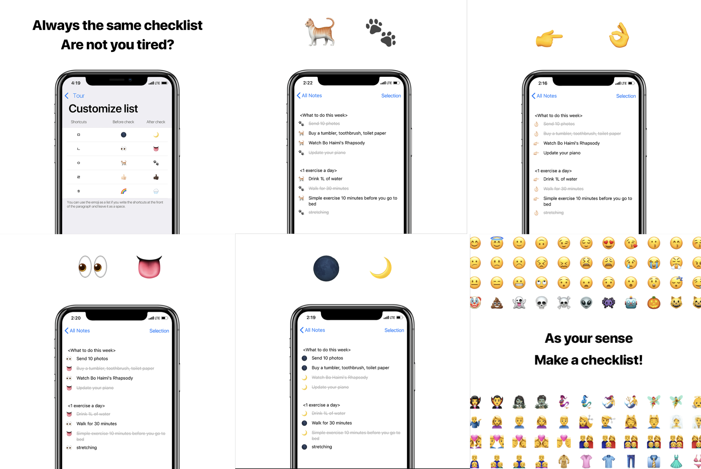

2. For Customize all everything like checklist or shortcut, define its key, value and shortcut.
```swift
enum BulletType {
        case key
        case value
        case shortcut    
}
```
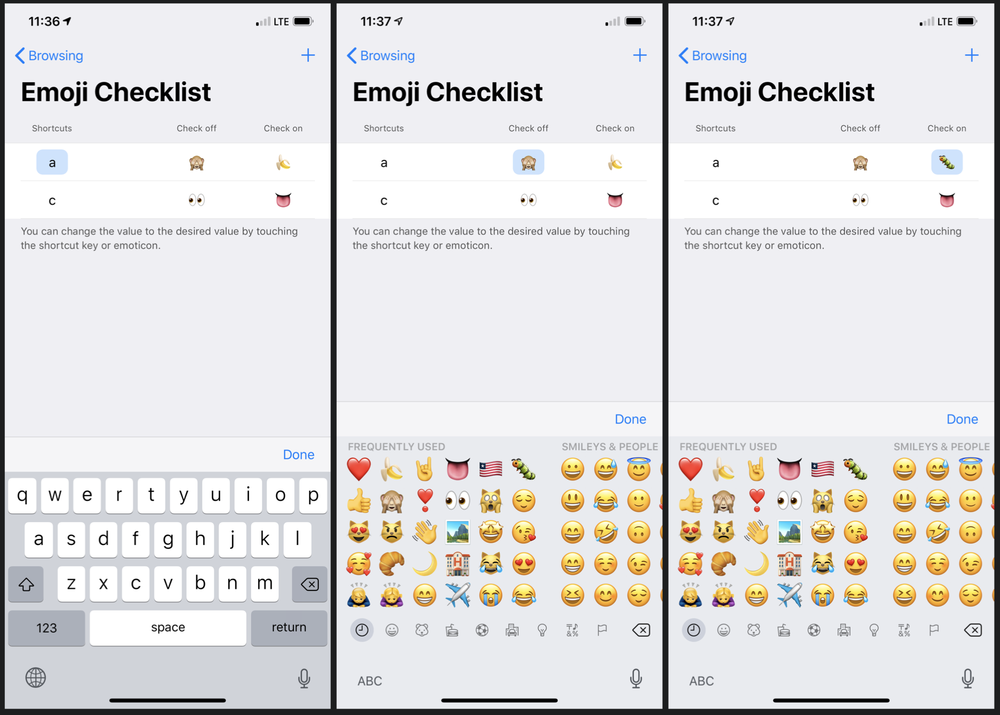
3. Using regex, Check whether exsiting key or not, and if exist, check whether todo or done.
```swift

var shortcutRegex: String {
        return "^\\s*([\(shortcut)])(?= )"
}

var keyOnRegex: String {
        return "^\\s*([\(keyOn)])(?= )"
}

var keyOffRegex: String {
        return "^\\s*([\(keyOff)])(?= )"
}   
```

4. When typing, if an action for creating checklist is detected, Convert shortcut to checklist.
```swift
func textViewDidChange(_ textView: TextView) {
  if let regex = FormShortcut(text: textView.text),
    let textRange = regex.rangeToRemove.toTextRange(textInput: textView) {                
      textView.replace(textRange, withText: "")
  }
}
```
<br/>
5. When typing, if an action for deleting checklist is detected, revert checklist to shortcut.
```swift
func textView(_ textView: TextView, shouldChangeTextIn range: NSRange, replacementText text: String) -> Bool {
        
        if let textView = textView as? TypingTextView {
            let state = typingState(textView: textView,
                                    replacementText: text)
            textView.hasChanged = true
            switch state {
            case .revertForm:
                revertForm(textView: textView)
                
            case .deleteForm:
                deleteForm(textView: textView)
                
            case .normal:
                return true
            }
            
        } else {
            return true
        }        
}
```
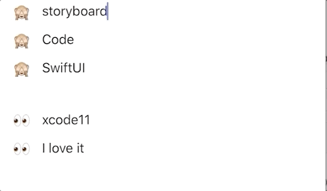<br/>

6. When user tap checklist, reordering datasource According to circumstances
```swift
switch type {
case .todo:
  let lastIndexPath = document.lastCheckTypeIndexPath(indexPath: indexPath)
  if indexPath != lastIndexPath {
    tableView.performBatchUpdates({
    let currentStr = document.strArray.remove(at: indexPath.row)
    document.strArray.insert(currentStr, at: lastIndexPath.row)
    tableView.moveRow(at: indexPath, to: lastIndexPath)
     }, completion: nil)
   }

case .done:
   let firstIndexPath = document.firstCheckTypeIndexPath(indexPath: indexPath)
   if indexPath != firstIndexPath {
    tableView.performBatchUpdates({
      let str = document.strArray.remove(at: indexPath.row)
      document.strArray.insert(str, at: firstIndexPath.row)
      tableView.moveRow(at: indexPath, to: firstIndexPath)
    }, completion: nil)
  }
}
```
<br/>
</br></br></br></br>
## 5. Placeholder

:feet: Placeholder is a technology for creating custom templates by user.
User can create a templates that are not exist on built in template, and even User can modify template in exist template categories.<br/><br/>
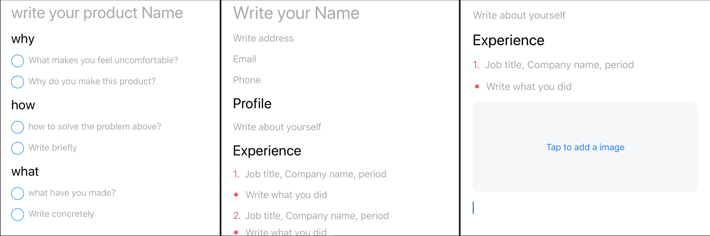

### Why
- Usually, There is no template user want in template categories.
- Users want custom templates in template categories.

### How
- provide the method of creating and modifying templates.

### What
- To create a template, Define a regex for each type's placeholder.
- When User type the specific keys for placeholders, it creates/deletes.

### Getting Started
1. You can use an App for using Placeholder. Clone this project.

2. Define a regex for shorcut which makes placeholder.<br/>
ex) Placeholder$ <br/>
```swift
struct PlaceholderShortcut {
    let regex = "^([^\\$]+)(?=\\$ )"
    
    let string: String
    let rangeToRemove: NSRange
    let paraRange: NSRange
    
    public init?(text: String) {
        let nsText = text as NSString
        let range = NSRange(location: 0, length: 0)
        let paraRange = nsText.paragraphRange(for: range)
        
        if let (string, range) = text.detect(searchRange: paraRange, regex: regex) {
            self.string = string
            self.paraRange = paraRange
            //3 includes (, ) and space
            self.rangeToRemove = NSRange(location: range.location, length: range.length + 2)
            return
        }
        return nil
    }
}
```

2. Check whether user create placeholder in TextViewDidChange delegate, and if it does, convert to placeholder of its type..
```swift
if cell.placeholder == nil {
  if let placeholderShortcut = PlaceholderShortcut(text: textView.text) {
    let textRange = placeholderShortcut.rangeToRemove.toTextRange(textInput: textView)!
    textView.placeholder = placeholderShortcut.string
    textView.replace(textRange, withText: "")
  }
}
```
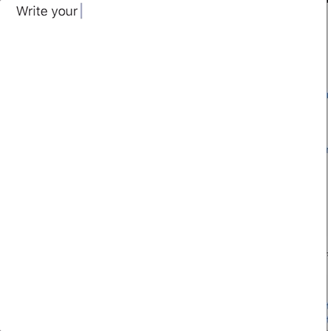

3. Check whether user delete placehodler in TextShouldChange delegate, and it does, revert to shortcut of its type.
```swift
func textView(_ textView: TextView, shouldChangeTextIn range: NSRange, replacementText text: String) -> Bool {
  if isBeginningPosition && text.isEmpty {
    if textView.placeholder != nil {
      revertPlaceholder(textView: textView)
    }
  }
  return true
}

func revertPlaceholder(textView: TypingTextView) {
  guard let cell = textView.textBlockCell,
    let placeholder = textView.placeholder else {
      fatalError("Cannot be this case") }
        
  textView.insertText(placeholder + "$")
  textView.placeholder = nil
  cell.placeholder = nil
}

```
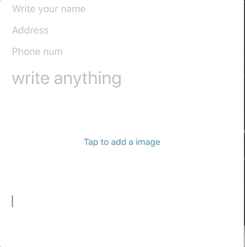
